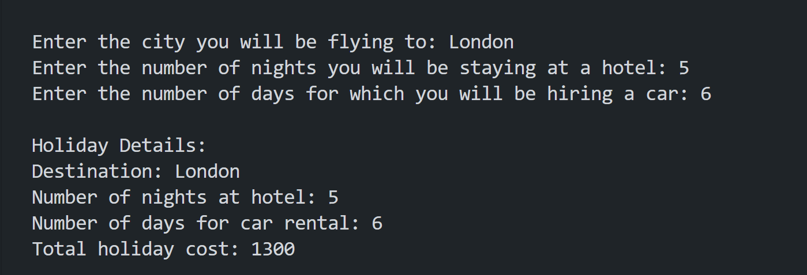

# Holiday Cost

## Description
This python code will calculate a user’s total holiday cost, which includes the plane cost, hotel cost, and car-rental cost.
● First, the code will ask the user to enter the following inputs:
○ city_flight: The city they will be flying to. I have created some options for them. Each city will have different flight costs.
○ num_nights: The number of nights they will be staying at a hotel.
○ rental_days: The number of days for which they will be hiring a
car.
● I have created the following functions to handle different cases:
● hotel_cost(): This function will take 'num_nights' as an argument,
and return a total cost for the hotel stay. The cost per night can be customised. 

● plane_cost(): This function will take city_flight as an argument
and return a cost for the flight. 
● car_rental(): This function will take rental_days as an argument
and return the total cost of the car rental cost.
● holiday_cost(): This function takes three arguments: num_nights,
city_flight, and rental_days. Using these three arguments, call the
hotel_cost(), plane_cost(), and car_rental() functions with
their respective arguments, and finally return the total cost for the
holiday.
● The outcomes will be printed to show the cost of the holiday in a readable way.
● Try
 
## Table of Contents
- [Holiday Cost](#holiday-cost)
  - [Description](#description)
  - [Table of Contents](#table-of-contents)
  - [Installation](#installation)
  - [Usage](#usage)
  - [License](#license)
  - [Contributing](#contributing)
  - [Credits](#credits)
  - [Tests](#tests)
  - [Questions](#questions)

## Installation
How to install Python in terminal?
Step 1: Download the Python installer. Visit the official Python website and download the latest version of Python 3.x for Windows. ...
Step 2: Run the Installer. ...
Step 3: Customize the Installation (Optional) ...
Step 4: Install Python. ...
Step 5: Verify the installation.

How to add pip to path Python?
How to Add Python Pip to Path
Locate pip Installation:
Modify the PATH Environment Variable for this session:
Modify the PATH Environment Variable permanently:
Verify the Modification:
Locate pip Installation:
Modify the PATH Environment Variable:
Add the Path to the Environment Variables:
Verify the Modification:

## Usage

A screenshot of the outcomes is shown here:

The repository can be accessed using this link:https://github.com/Mikemupararano/holiday-cost.

## License
This application is covered under the MIT license.

## Contributing
 N/A

## Credits
N/A
## Tests
N/A

## Questions
For any questions or concerns, please contact me at [kudath@yahoo.co.uk](mailto:kudath@yahoo.co.uk).
You can also find me on GitHub: [https://github.com/Mikemupararano](https://github.com/https://github.com/Mikemupararano)
